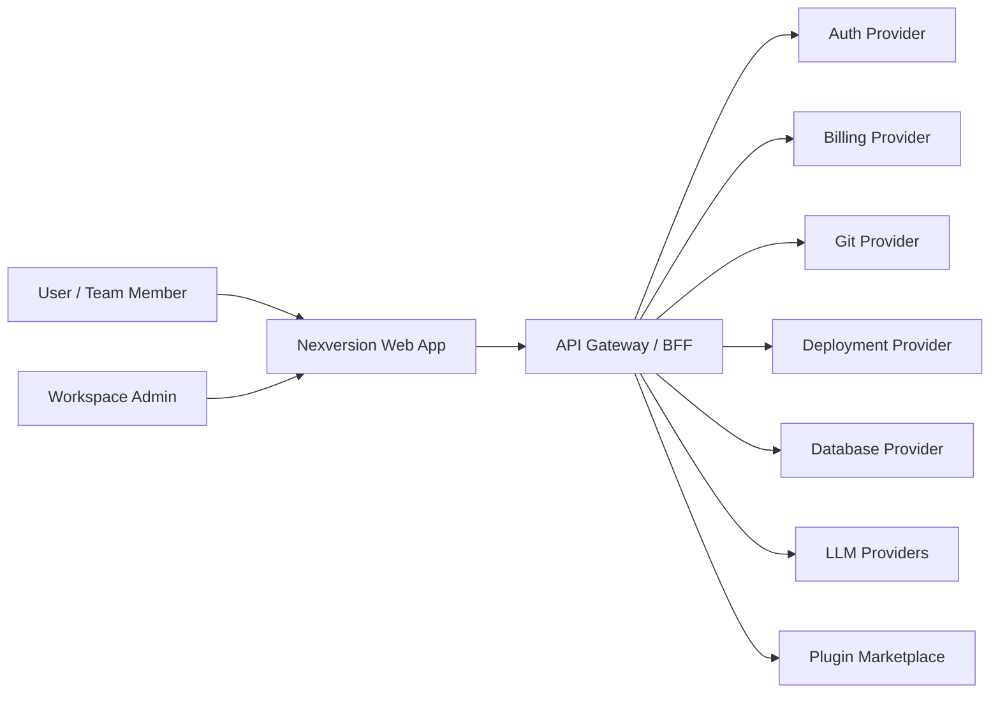
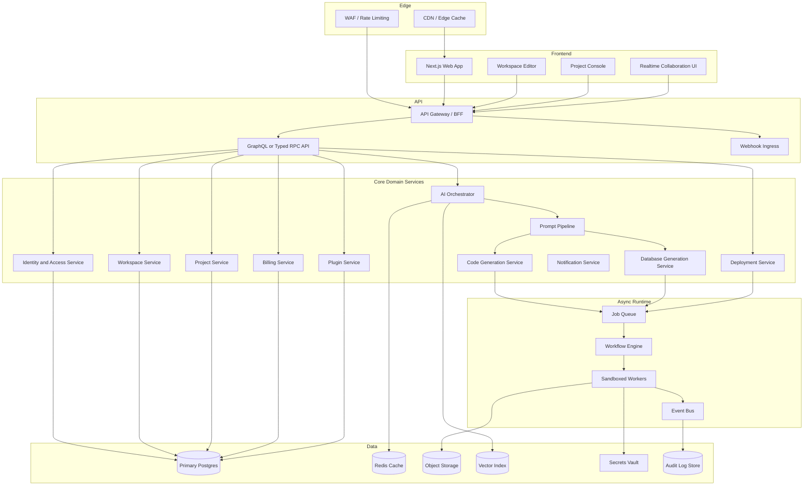
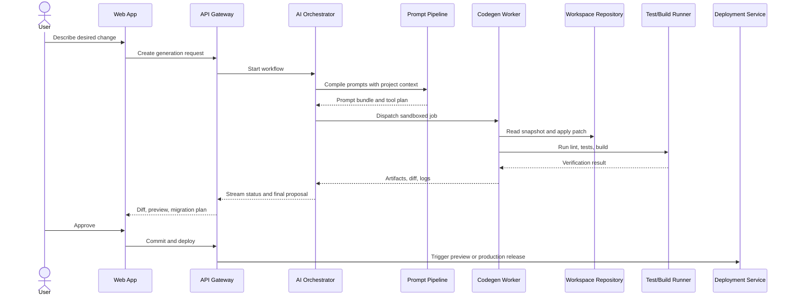
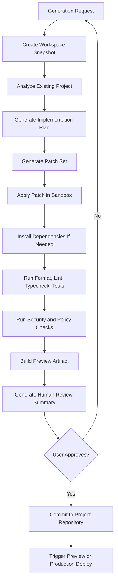
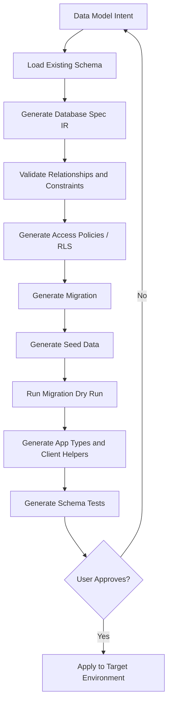
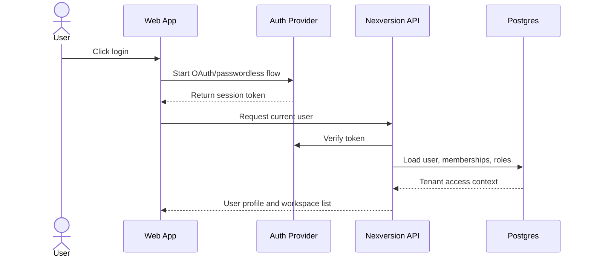
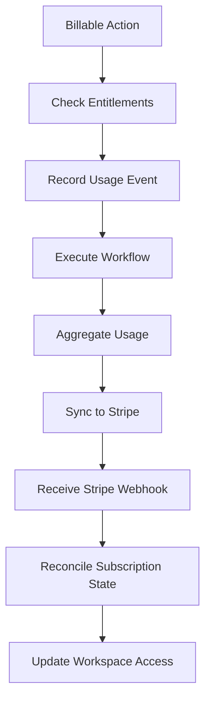
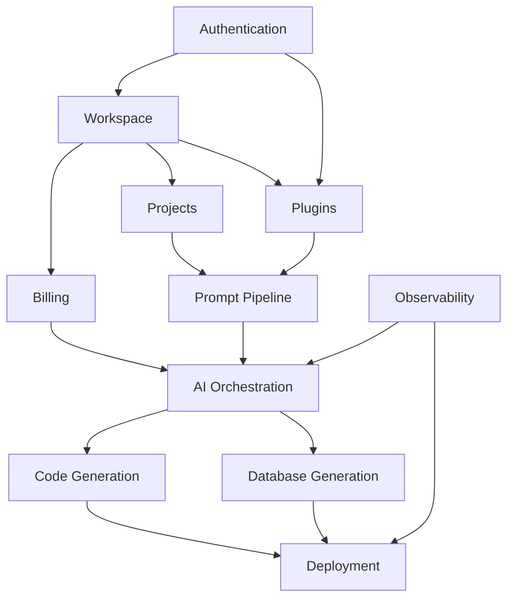

# Nexversion System Architecture Map

## 1. Purpose and assumptions

This document defines a target architecture for Nexversion as an AI-assisted software generation platform. The repository currently contains only a minimal README, so this map is intentionally product-architecture oriented rather than a description of existing code.

Nexversion is assumed to provide:

- Multi-tenant workspaces and projects.
- AI-assisted app, database, and deployment generation.
- Browser-based project editing and collaboration.
- Authentication, billing, plugins, and deployment integrations.
- A scalable backend that can execute long-running AI/code-generation workflows safely.

## 2. Visual structure

### 2.1 Platform context



### 2.2 Internal system map



### 2.3 Request-to-artifact lifecycle



## 3. Recommended tech stack

### 3.1 Product frontend

- Framework: Next.js with React, TypeScript, and App Router.
- Styling: Tailwind CSS with a component system such as shadcn/ui or Radix UI primitives.
- State: TanStack Query for server state, Zustand or Jotai for local editor state.
- Forms: React Hook Form with Zod schemas shared from API contracts.
- Editor: Monaco Editor for code, xterm.js for terminal streams, React Flow for workflow visualization.
- Realtime: WebSocket or Server-Sent Events for generation status; Yjs if collaborative editing is required.
- Testing: Vitest, Testing Library, Playwright for end-to-end flows.

### 3.2 Backend and workflow runtime

- Language: TypeScript across API, workers, and shared packages.
- API: Next.js route handlers for lightweight BFF endpoints, or Fastify/NestJS when service separation grows.
- Contracts: tRPC for fast internal iteration or GraphQL when external plugin/API consumers need flexible queries.
- Workflow engine: Temporal for durable AI, codegen, database, and deployment workflows.
- Queue: BullMQ or Temporal task queues for short jobs; NATS or Kafka for platform events at higher volume.
- Database: Postgres for primary relational state.
- Cache: Redis for sessions, idempotency keys, rate limits, job status snapshots, and hot reads.
- Object storage: S3-compatible storage for generated artifacts, logs, build outputs, and workspace snapshots.
- Vector storage: pgvector for early-stage retrieval, with a dedicated vector database only after retrieval volume requires it.
- Sandbox: Firecracker, gVisor, Docker-in-Docker isolation, or a managed sandbox provider for untrusted code execution.

### 3.3 AI and generation layer

- Model access: Provider-agnostic model gateway supporting OpenAI, Anthropic, Google, and self-hosted models.
- Orchestration: Durable workflow state in Temporal; prompt templates versioned in source control.
- Retrieval: Hybrid search over repository files, product docs, previous generation logs, and workspace metadata.
- Validation: Static checks, schema validation, policy checks, dependency scanning, and test execution before user approval.
- Observability: OpenTelemetry traces with prompt IDs, model IDs, token usage, tool calls, and workflow step timing.

### 3.4 Platform operations

- Hosting: Vercel or Cloudflare Pages for the frontend; Kubernetes, Fly.io, Render, or ECS for API/workers.
- CI/CD: GitHub Actions with preview deployments per branch and production promotion from main.
- Secrets: Cloud secrets manager or Vault; never store provider tokens in application tables unencrypted.
- Monitoring: OpenTelemetry, Prometheus-compatible metrics, structured logs, Sentry for frontend/backend exceptions.
- Payments: Stripe Billing, Customer Portal, metered usage, and webhooks.

## 4. Folder strategy

Use a monorepo so shared contracts, prompts, domain types, and generated artifacts evolve together.

```text
nexversion-platform/
  apps/
    web/                         # Next.js product UI and BFF routes
    worker/                      # Background worker process entrypoint
    sandbox-runner/              # Isolated code execution entrypoint
  services/
    api/                         # Optional standalone API service if split from Next.js
    orchestrator/                # AI workflow orchestration service
    deployer/                    # Deployment provider adapters and release workflows
    webhooks/                    # Stripe, auth, Git, deployment webhook ingress
  packages/
    auth/                        # Auth helpers, RBAC, session utilities
    billing/                     # Plans, entitlements, usage metering
    contracts/                   # API schemas, events, shared Zod types
    database/                    # Prisma/Drizzle schema, migrations, seed data
    feature-flags/               # Flag definitions and evaluation helpers
    prompts/                     # Versioned prompt templates and prompt tests
    plugins/                     # Plugin SDK, manifest schema, permissions
    project-model/               # Project IR, file tree, app/database/deploy specs
    telemetry/                   # Logging, tracing, metrics utilities
    ui/                          # Shared UI components
  docs/
    architecture/                # System maps, ADRs, sequence diagrams
    product/                     # Product requirements and user journeys
    runbooks/                    # Operational runbooks
  infra/
    terraform/                   # Cloud resources
    kubernetes/                  # Runtime manifests if using Kubernetes
    github-actions/              # Reusable workflow definitions
  tests/
    e2e/                         # Browser-level user journeys
    fixtures/                    # Sample projects and generated outputs
```

### 4.1 Feature-oriented frontend structure

```text
apps/web/src/
  app/                           # Route tree
  components/                    # Cross-feature presentation components
  features/
    auth/
    billing/
    dashboard/
    deployment/
    generation/
    plugins/
    projects/
    settings/
    workspace/
  lib/
    api-client/
    config/
    telemetry/
    validators/
  server/                        # BFF handlers and server-only helpers
```

### 4.2 Backend package boundaries

```text
services/orchestrator/src/
  workflows/                     # Durable workflow definitions
  activities/                    # Tool execution, LLM calls, retrieval, validation
  policies/                      # Safety, quota, and permission checks
  streams/                       # Realtime status event publishing

packages/project-model/src/
  app-spec.ts                    # Frontend/backend app IR
  db-spec.ts                     # Database schema IR
  deploy-spec.ts                 # Deployment target IR
  file-tree.ts                   # Workspace file tree model
  patch.ts                       # Generated change representation
```

## 5. Frontend architecture

### 5.1 Layers

1. App shell:
   - Global layout, navigation, command palette, workspace switcher, user menu.
   - Loads authenticated user, active workspace, plan entitlements, and feature flags.
2. Route features:
   - Dashboard, project overview, generation console, database designer, deployments, billing, plugins, settings.
3. Data layer:
   - Typed API client.
   - TanStack Query cache keyed by workspace ID and project ID.
   - Optimistic updates for draft project metadata and UI-only generation state.
4. Realtime layer:
   - Generation workflow stream.
   - Build/deploy logs.
   - Collaboration presence and file cursor positions.
5. Editor layer:
   - File tree, code editor, generated diff viewer, terminal/log panels, preview frame.
6. Security and access:
   - Route guards check authentication, workspace membership, RBAC role, and billing entitlement.

### 5.2 Primary frontend routes

```text
/
/login
/signup
/onboarding
/workspaces
/w/[workspaceSlug]
/w/[workspaceSlug]/projects
/w/[workspaceSlug]/projects/[projectId]
/w/[workspaceSlug]/projects/[projectId]/generate
/w/[workspaceSlug]/projects/[projectId]/database
/w/[workspaceSlug]/projects/[projectId]/deployments
/w/[workspaceSlug]/settings
/w/[workspaceSlug]/billing
/w/[workspaceSlug]/plugins
```

### 5.3 Frontend dependencies

- Auth depends on identity provider SDK, session API, and RBAC contracts.
- Workspace UI depends on workspace service, membership service, billing entitlements, and feature flags.
- Generation UI depends on project service, AI orchestration events, codegen artifacts, and deployment previews.
- Billing UI depends on Stripe Customer Portal, usage summaries, invoice data, and plan entitlement definitions.
- Plugin UI depends on plugin registry, installed plugin records, permission review, and workspace admin role.

## 6. Backend architecture

### 6.1 API gateway / BFF

Responsibilities:

- Authenticate requests and attach tenant context.
- Enforce RBAC and entitlement checks before domain service calls.
- Provide typed endpoints optimized for frontend screens.
- Accept webhook ingress and convert external events to internal events.
- Start long-running workflows but never run heavy generation directly in request handlers.

### 6.2 Domain services

| Service | Core responsibility | Primary data |
| --- | --- | --- |
| Identity and Access | Users, sessions, workspace roles, API keys | users, memberships, roles |
| Workspace | Workspace lifecycle, settings, invites | workspaces, invites, preferences |
| Project | Projects, file snapshots, app specs | projects, project_versions, files |
| AI Orchestrator | Durable generation workflows | generation_requests, workflow_runs |
| Prompt Pipeline | Prompt compilation and evaluation | prompt_versions, prompt_runs |
| Code Generation | Patches, tests, builds, generated artifacts | code_artifacts, validation_results |
| Database Generation | Schema IR, migrations, seed data, RLS | db_specs, migrations |
| Deployment | Preview/prod releases and provider adapters | deployments, environments |
| Billing | Plans, subscriptions, usage, entitlements | customers, subscriptions, usage_events |
| Plugin | Registry, installs, plugin permissions | plugins, plugin_installs |
| Notification | Email, in-app notifications, alerts | notifications |

### 6.3 Data ownership

- Domain services own writes to their tables.
- Shared read models are allowed for UI performance but are derived from events.
- Cross-service operations use workflow orchestration and idempotency keys.
- External provider state is mirrored locally only for reconciliation and user display.

### 6.4 Event model

```text
workspace.created
workspace.member_invited
project.created
project.version_created
generation.requested
generation.step_started
generation.step_completed
generation.failed
code.patch_created
database.migration_created
deployment.preview_created
deployment.promoted
billing.subscription_updated
billing.usage_recorded
plugin.installed
plugin.permission_changed
```

## 7. AI orchestration

### 7.1 Orchestrator responsibilities

- Convert user intent into a durable workflow.
- Select the right tools and model based on task type, cost, latency, and quality requirements.
- Retrieve relevant workspace context.
- Enforce safety, billing quota, and permissions before tool execution.
- Stream progress to the frontend.
- Persist all prompts, model outputs, decisions, generated files, and validation results.
- Produce a reviewable artifact rather than silently mutating production resources.

### 7.2 Agent roles

| Agent | Purpose | Inputs | Outputs |
| --- | --- | --- | --- |
| Intake agent | Classifies request and extracts requirements | User prompt, project metadata | Task type, constraints, acceptance criteria |
| Planner agent | Creates implementation plan | Requirements, repository context | Ordered steps, file targets, validation plan |
| Codegen agent | Generates source changes | Plan, file context, framework rules | Patch set |
| Database agent | Generates schema and migrations | Data model intent, existing schema | DB spec, migration files, seed data |
| Review agent | Checks generated output | Patch, tests, policies | Findings, required fixes |
| Deploy agent | Prepares preview/prod release | Build output, environment config | Deployment plan and release metadata |

### 7.3 Model gateway

The model gateway provides:

- Provider abstraction and failover.
- Request logging with redaction.
- Token accounting by workspace, project, user, and workflow.
- Model routing by capability: fast classification, long-context planning, code generation, reasoning-heavy review.
- Prompt and response retention policies.
- Safety filters before and after model calls.

## 8. Prompt pipeline

### 8.1 Pipeline stages

```mermaid
flowchart LR
  Intent[User Intent]
  Normalize[Normalize and Classify]
  Policy[Policy and Entitlement Check]
  Retrieve[Context Retrieval]
  Rank[Context Ranking]
  Compile[Prompt Compilation]
  Execute[Model Execution]
  Parse[Structured Output Parsing]
  Validate[Validation and Safety Checks]
  Persist[Persist Prompt Run]
  Artifact[Return Artifact]

  Intent --> Normalize --> Policy --> Retrieve --> Rank --> Compile --> Execute --> Parse --> Validate --> Persist --> Artifact
```



### 8.2 Prompt assets

- System prompts define product behavior, safety constraints, coding standards, and output contracts.
- Developer prompts define feature-specific generation instructions.
- Context blocks include selected files, schemas, API contracts, workspace settings, plugin capabilities, and billing constraints.
- Output schemas use Zod or JSON Schema to force structured model responses.
- Prompt evaluations run against fixture projects to catch regressions.

### 8.3 Prompt versioning

Each prompt run should store:

- Prompt template version.
- Model and provider.
- Retrieval query and selected context IDs.
- Input token count, output token count, latency, and cost.
- Structured output and validation result.
- Workflow ID and user-visible artifact ID.

## 9. Code generation flow

### 9.1 Flow



### 9.2 Generation invariants

- Generation runs in an isolated workspace snapshot.
- The original project state is immutable during a workflow.
- Generated changes are represented as structured patches with file metadata.
- All generated code must pass the configured validation gates before it can be promoted.
- Dependency additions require explicit recording for billing/security review.
- Secrets are injected only through the sandbox secret broker and are never included in prompts.

### 9.3 Artifacts

- Implementation plan.
- Patch set.
- Generated files.
- Migration files.
- Validation logs.
- Preview URL.
- Cost and token usage summary.
- Human-readable review summary.

## 10. Database generation flow

### 10.1 Flow



### 10.2 Database specification

The database agent should generate an intermediate representation before writing SQL or ORM code:

```text
DatabaseSpec
  tables
    columns
    indexes
    constraints
    relationships
    tenant_scope
    access_policy
  migrations
  seed_data
  generated_types
```

### 10.3 Database safety

- Run destructive migration checks before applying.
- Require explicit user approval for production schema changes.
- Generate reversible migrations when possible.
- Store migration dry-run output.
- Enforce tenant isolation through workspace/project IDs and row-level security where supported.
- Keep generated app types in sync with the schema.

## 11. Deployment pipeline

### 11.1 Pipeline

```mermaid
flowchart LR
  Commit[Approved Commit]
  CI[CI Workflow]
  Test[Tests and Typecheck]
  Build[Build Artifact]
  Scan[Security and Dependency Scan]
  Preview[Preview Deployment]
  Smoke[Smoke Tests]
  Promote[Manual or Policy Promotion]
  Prod[Production Deployment]
  Monitor[Monitoring and Rollback]

  Commit --> CI --> Test --> Build --> Scan --> Preview --> Smoke --> Promote --> Prod --> Monitor
```



### 11.2 Environments

- Development: local or sandboxed generation environment.
- Preview: every approved generation creates a shareable preview deployment.
- Staging: production-like environment for workspace admins or internal QA.
- Production: controlled promotion with rollback support.

### 11.3 Deployment service responsibilities

- Store environment definitions and provider credentials.
- Resolve build commands and runtime settings from project metadata.
- Inject environment variables from the secret broker.
- Track build logs and deployment status.
- Support rollback to previous successful releases.
- Normalize provider-specific events into internal deployment events.

## 12. Authentication flow

### 12.1 User login



### 12.2 Authorization model

Recommended roles:

- Owner: full workspace control, billing, member management, production deploys.
- Admin: project, plugin, and deployment control; no billing ownership transfer.
- Developer: project editing, generation, preview deploys.
- Viewer: read-only access.
- Billing manager: billing access without project mutation.

### 12.3 Auth controls

- Enforce tenant context at the API boundary.
- Use database-level tenant keys and service-level RBAC checks.
- Support SSO/SAML for enterprise workspaces.
- Issue scoped API tokens for automation and plugins.
- Record audit events for security-sensitive actions.

## 13. Billing architecture

### 13.1 Billing model

Billing should combine subscription entitlements and metered AI/platform usage.

Subscription dimensions:

- Workspace seats.
- Private projects.
- Deployment environments.
- Plugin access tier.
- Collaboration features.

Metered dimensions:

- AI input/output tokens.
- Generation workflow runs.
- Build minutes.
- Sandbox execution minutes.
- Storage.
- Preview deployment bandwidth or runtime.

### 13.2 Billing flow



### 13.3 Billing safeguards

- Reserve quota before expensive workflows begin.
- Stop or degrade generation when hard limits are reached.
- Show cost estimates before high-cost workflows.
- Store idempotency keys for all usage events.
- Reconcile local billing state from Stripe webhooks.
- Keep billing permissions separate from project permissions.

## 14. Workspace architecture

### 14.1 Workspace model

```text
Workspace
  id
  slug
  name
  plan
  settings
  members
  projects
  installed_plugins
  billing_account
  audit_log
```

### 14.2 Project model

```text
Project
  id
  workspace_id
  name
  framework
  repository_connection
  current_version
  app_spec
  db_spec
  deploy_targets
  environment_variables
  generation_history
```

### 14.3 Collaboration

- Workspace presence: who is online and which project they are editing.
- Project locks: prevent conflicting destructive actions like production deployment or migration application.
- File collaboration: use Yjs or explicit check-out/check-in if simultaneous editing becomes a core feature.
- Audit log: all generation, deployment, billing, plugin, auth, and role changes.

### 14.4 Workspace isolation

- All primary records include workspace ID.
- Every request resolves workspace context before domain operations.
- Object storage keys include tenant scope.
- Search/vector entries include workspace and project scope.
- Secrets are namespaced by workspace and environment.

## 15. Plugin architecture

### 15.1 Plugin goals

Plugins should extend Nexversion without gaining unrestricted access to tenant data or execution privileges.

Supported plugin types:

- UI extensions: dashboard panels, editor panels, project tabs.
- Generation tools: domain-specific generators, validators, prompt context providers.
- Deployment adapters: additional hosting providers.
- Database adapters: additional database providers.
- Webhook integrations: issue trackers, chat tools, monitoring tools.

### 15.2 Plugin manifest

```json
{
  "name": "example-plugin",
  "version": "1.0.0",
  "entrypoint": "https://plugin.example.com/nexversion",
  "permissions": [
    "project:read",
    "generation:context:provide",
    "deployment:read"
  ],
  "uiExtensions": [
    {
      "slot": "project.sidebar",
      "label": "Example"
    }
  ],
  "webhooks": [
    "generation.completed"
  ]
}
```

### 15.3 Plugin runtime

- Validate plugin manifests during installation.
- Require workspace admin approval for permissions.
- Issue scoped credentials per workspace installation.
- Execute untrusted plugin code out-of-process.
- Rate-limit plugin API calls per installation.
- Emit audit events for plugin installs, permission changes, and privileged calls.
- Allow plugins to contribute prompt context only through structured, inspectable payloads.

### 15.4 Plugin dependency boundaries

- Plugins can depend on public API contracts and SDK packages.
- Core services must not depend on plugin implementation packages.
- Plugin hooks should be asynchronous and failure-isolated unless explicitly configured as blocking validators.

## 16. Feature dependencies

### 16.1 Dependency map



### 16.2 Build order recommendation

1. Foundations:
   - Auth, workspace model, project model, database schema, telemetry.
2. Core product:
   - Project dashboard, prompt pipeline, AI orchestration, generation event stream.
3. Generation:
   - Code generation sandbox, validation gates, artifact review UI.
4. Database and deployment:
   - Database spec/migration generation, preview deployments, environment secrets.
5. Commercial layer:
   - Billing, usage metering, entitlements, quotas.
6. Extensibility:
   - Plugin SDK, plugin registry, external developer APIs.

### 16.3 Critical cross-feature dependencies

| Feature | Must depend on | Must not depend on |
| --- | --- | --- |
| AI orchestration | Project model, prompt package, billing quota, telemetry | UI components |
| Prompt pipeline | Prompt templates, retrieval, output schemas | Provider-specific UI |
| Code generation | Sandbox, project snapshots, validation runners | Billing provider SDK directly |
| Deployment | Project build spec, secrets, provider adapters | Prompt internals |
| Billing | Workspace, usage events, entitlement definitions | Codegen implementation details |
| Plugins | Public SDK, manifest schema, permission model | Private service internals |

## 17. Scaling considerations

### 17.1 Frontend

- Use CDN caching for public assets and marketing pages.
- Keep workspace/project data behind authenticated dynamic routes.
- Stream long-running generation updates instead of polling aggressively.
- Virtualize large file trees, logs, and generation histories.
- Split editor-heavy bundles from dashboard routes.

### 17.2 API

- Keep API handlers stateless.
- Use Redis for rate limiting and idempotency.
- Apply per-workspace and per-user concurrency limits.
- Move long-running work to Temporal workers.
- Use request-scoped tenant context and structured logging.

### 17.3 AI workflows

- Route simple tasks to cheaper/faster models.
- Cache retrieval results and prompt context where safe.
- Store intermediate outputs for resume/retry.
- Enforce workflow-level budgets.
- Separate latency-sensitive chat/status flows from heavy generation workers.

### 17.4 Code execution

- Run untrusted code in disposable sandboxes.
- Limit CPU, memory, network, and filesystem access.
- Keep dependency caches outside tenant workspaces but verify integrity.
- Store build artifacts in object storage rather than worker disks.
- Use queue priorities for interactive user flows over background maintenance.

### 17.5 Database

- Start with a well-indexed Postgres schema and explicit tenant keys.
- Add read replicas for analytics-heavy views.
- Partition high-volume append-only tables such as events, logs, and usage records.
- Archive old workflow logs and artifacts to object storage.
- Keep vector retrieval scope tenant-aware and avoid cross-tenant embeddings leakage.

### 17.6 Billing and quotas

- Make usage writes append-only and idempotent.
- Aggregate usage asynchronously for dashboards and provider sync.
- Fail closed for unpaid/over-quota production-impacting actions.
- Allow soft limits for low-risk preview actions if product policy requires it.

### 17.7 Plugins

- Execute plugin callbacks asynchronously by default.
- Rate-limit and circuit-break failing plugins.
- Version plugin API contracts.
- Require explicit migration paths for breaking SDK changes.
- Keep marketplace search/indexing separate from runtime execution.

## 18. Security and compliance baseline

- Encrypt secrets at rest with envelope encryption.
- Redact secrets before prompt construction and logging.
- Maintain audit logs for role changes, billing changes, generation approvals, deployment promotions, and plugin permission changes.
- Apply least-privilege service credentials.
- Require production deployment approvals by role and policy.
- Scan generated dependencies for known vulnerabilities.
- Provide workspace-level data export and deletion workflows.

## 19. Observability map

Trace every user-facing generation from click to deployment:

```text
request_id
workspace_id
project_id
user_id
workflow_id
prompt_run_id
model_provider
model_name
token_usage
sandbox_job_id
artifact_id
deployment_id
```

Core dashboards:

- Generation success rate and failure categories.
- Model latency, token usage, and cost per workspace.
- Sandbox queue depth and execution duration.
- Deployment success rate and rollback count.
- Billing usage reconciliation status.
- Plugin error rate and throttling.

## 20. Architecture decisions to confirm

The first implementation should confirm these decisions early:

- Whether the API is initially embedded in Next.js or split into a standalone service.
- Whether tRPC or GraphQL is preferred for client/API contracts.
- Which workflow engine will be adopted for durable orchestration.
- Which sandbox provider or isolation model is acceptable for generated code execution.
- Which auth provider and billing provider are product requirements versus recommendations.
- Whether generated projects are stored in Nexversion-managed repositories, user-connected repositories, or both.
